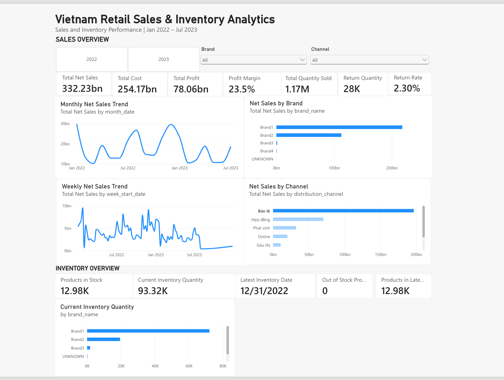

# Vietnam Retail Sales & Inventory Analytics

End-to-end data analytics and business intelligence portfolio project built from a Vietnamese retail sales and inventory dataset. The project covers data profiling, cleaning, master-data validation, dimensional modeling, Power BI preparation, dashboard design, and KPI validation.



## Project Objective

The goal is to transform raw retail sales and inventory snapshots into an analysis-ready star schema and an interactive dashboard that answers practical business questions:

- How are net sales, cost, profit, quantity, and returns changing over time?
- Which brands and distribution channels contribute the most net sales?
- What is the latest available inventory position?
- How much inventory is held by each brand?
- Can the dashboard KPIs be reproduced independently from the processed data?

## Dataset

The source archive contains 37 readable Excel workbooks:

- 19 monthly Sales snapshot files: Jan 2022–Jul 2023
- 12 Inventory snapshot files: Jan–Dec 2022
- 6 Master Data files: product, distribution/customer, calendar, classification, COGS, and retail price

The processed sales dataset contains **831,966 rows**. The final model contains **1,367,080 inventory fact rows**.

> Raw data is intentionally not committed to this repository. Download the source dataset separately and keep it under `data/raw/`.

## Tech Stack

- **Python:** Pandas, NumPy, Jupyter
- **Data Modeling:** dimensional modeling, star schema, surrogate keys
- **BI:** Power BI Service / PBIX, Power Query / semantic model, DAX
- **Validation:** Python-based KPI reconciliation
- **Version Control:** Git / GitHub

This implementation uses **Python/Pandas → CSV → Power BI Service**. SQL Server is not claimed as part of the implemented pipeline.

## Data Pipeline

```text
Raw Excel Workbooks
        |
        v
01 Data Understanding
        |
        v
02 Cleaning & Business Rules
        |
        v
03 Master Data Validation
        |
        v
04 Star Schema Preparation
        |
        v
05 Power BI CSV Export
        |
        v
Power BI Semantic Model + DAX
        |
        v
Interactive Dashboard
        |
        v
06 Independent KPI Validation
```

## Data Quality Decisions

Several source-data issues required explicit decisions instead of blind cleaning:

### Returns and reversals
Negative `sold_quantity`, `cost_price`, and `net_price` records are retained. Their sign pattern is consistent with return/reversal activity, so deleting them would distort net sales and quantity.

### Duplicate-looking sales rows
Potential duplicate business rows are flagged rather than automatically removed because the source does not provide an invoice/order/transaction identifier that would prove they are accidental duplicates.

### Missing customer
One missing sales customer identifier is mapped to an `UNKNOWN` dimension member so the fact row is preserved.

### Zero-value transactions
Rows with zero net price are retained and classified as zero-value activity.

### Invalid week `202153`
The source contains `202153`, which cannot be mapped to a valid ISO week-start date. The records remain in `FactSales` and therefore contribute to total KPIs, but they are excluded naturally from the weekly date-axis visualization because their dimension date is blank.

### Effective-dated master tables
COGS, retail price, and product classification have temporal or multi-row grain. They are not flattened into `DimProduct` for the MVP because a direct merge would create row multiplication and potentially incorrect measures.

## Star Schema

```text
                     DimProduct
                        |
                        v
DimWeek -----------> FactSales <----------- DimCustomer
                        |
                        ^
                        |
                     DimSite


                     DimProduct
                        |
                        v
DimDate ----------> FactInventory <--------- DimPlant
```

Core dimensions use surrogate keys and include an Unknown member where required.

### Final table sizes

| Table | Rows |
|---|---:|
| FactSales | 831,966 |
| FactInventory | 1,367,080 |
| DimProduct | 94,868 |
| DimCustomer | 3,406 |
| DimSite | 3,159 |
| DimPlant | 60 |
| DimWeek | 86 |
| DimDate | 335 |

## Dashboard

The dashboard contains two analytical sections.

### Sales Overview

KPIs:
- Total Net Sales
- Total Cost
- Total Profit
- Profit Margin
- Total Quantity Sold
- Return Quantity
- Return Rate

Visuals:
- Monthly Net Sales Trend
- Weekly Net Sales Trend
- Net Sales by Brand
- Net Sales by Channel

Filters:
- Year
- Brand
- Channel

### Inventory Overview

KPIs:
- Products in Stock
- Current Inventory Quantity
- Latest Inventory Date
- Out of Stock Products
- Products in Latest Snapshot

Visual:
- Inventory Quantity by Brand

The Brand dimension filters both sales and inventory. Sales-only filters/interactions are intentionally prevented from changing inventory visuals where that business relationship is not meaningful.

## Core DAX Measures

```DAX
Total Net Sales =
SUM(FactSales[net_price])

Total Cost =
SUM(FactSales[cost_price])

Total Profit =
SUM(FactSales[profit])

Profit Margin =
DIVIDE([Total Profit], [Total Net Sales], 0)

Total Quantity Sold =
SUM(FactSales[sold_quantity])

Return Quantity =
ABS(
    CALCULATE(
        SUM(FactSales[sold_quantity]),
        FactSales[sold_quantity] < 0
    )
)

Gross Sold Quantity =
CALCULATE(
    SUM(FactSales[sold_quantity]),
    FactSales[sold_quantity] > 0
)

Return Rate =
DIVIDE([Return Quantity], [Gross Sold Quantity], 0)
```

Inventory measures use the latest available inventory snapshot and aggregate stock at product grain before classifying products as in-stock or out-of-stock.

## Validated Dashboard Baseline

The full dashboard context is expected to show approximately:

| KPI | Dashboard |
|---|---:|
| Total Net Sales | 332.23bn |
| Total Cost | 254.17bn |
| Total Profit | 78.06bn |
| Profit Margin | 23.5% |
| Total Quantity Sold | 1.17M |
| Return Quantity | ~28K |
| Return Rate | ~2.3% |
| Current Inventory Quantity | 93.32K |
| Products in Stock | 12.98K |
| Latest Inventory Date | 2022-12-31 |
| Out of Stock Products | 0 |

`06_dashboard_validation.ipynb` independently recalculates the core metrics from the exported model tables and produces PASS/FAIL reconciliation tables.


## Validation Status

**ALL CORE KPI CHECKS PASSED.**

The executed validation notebook independently reproduced the Sales and Inventory KPIs from the exported model tables. Detailed results are available in [`validation/VALIDATION_RESULTS.md`](validation/VALIDATION_RESULTS.md).

## Key Observations

- Brand1 is the dominant sales and inventory brand in the dataset.
- Retail (`Bán lẻ`) is the largest distribution channel by net sales.
- Net sales fluctuate materially month-to-month rather than following a simple monotonic trend.
- The latest inventory snapshot is **31 Dec 2022**, while sales continue through **Jul 2023**. Inventory KPIs therefore must not be interpreted as July 2023 stock.
- Products in Stock and Products in Latest Snapshot are equal in the latest snapshot under the implemented product-grain definition; the resulting Out of Stock count is zero.

## Limitations

- Inventory data ends in Dec 2022 while sales data extends to Jul 2023.
- The source does not include a reliable transaction/order identifier, so duplicate-looking sales records cannot be safely deduplicated.
- `202153` is preserved for KPI integrity but cannot be plotted on a valid ISO weekly date axis.
- Inventory `total_amount` semantics were not sufficiently validated, so an Inventory Value KPI is intentionally excluded.
- COGS and retail-price master tables are effective-dated and require temporal joins for future analysis.
- This project does not claim SQL Server usage in the current implementation.

## Repository Structure

```text
vietnam-retail-sales-inventory-analytics/
├── notebooks/
│   ├── 01_data_understanding.ipynb
│   ├── 02_data_cleaning.ipynb
│   ├── 03_master_data_preparation.ipynb
│   ├── 04_star_schema_preparation.ipynb
│   ├── 05_powerbi_data_export.ipynb
│   └── 06_dashboard_validation.ipynb
├── screenshots/
│   └── dashboard.png
├── sql/
│   └── README.md
├── powerbi/
│   ├── Vietnam_Retail_Sales_Inventory_Analytics.pbix
│   └── README.md
├── validation/
│   ├── VALIDATION_RESULTS.md
│   ├── sales_kpi_validation.csv
│   ├── inventory_kpi_validation.csv
│   ├── return_kpi_validation.csv
│   └── brand1_filter_validation.csv
├── requirements.txt
├── .gitignore
└── README.md
```

## How to Run

1. Download and extract the source dataset into `data/raw/`.
2. Run notebooks `01` through `05` in sequence.
3. Import the exported star-schema CSV files into Power BI Service.
4. Create the documented relationships and DAX measures.
5. Build the dashboard.
6. Run `06_dashboard_validation.ipynb` and verify the KPI reconciliation.

## Portfolio Talking Points

This project demonstrates more than dashboard creation. It shows the ability to:

- inspect and profile multi-file business datasets;
- make defensible data-quality decisions;
- distinguish fact and dimension grain;
- prevent row explosion during master-data joins;
- build surrogate-key star schemas;
- design meaningful cross-filter behavior;
- write business KPIs in DAX;
- independently validate BI outputs with Python;
- document limitations instead of hiding uncertain source semantics.

## Future Improvements

- Add a SQL Server staging/warehouse layer and reproduce validation with SQL.
- Implement temporal joins for COGS and retail price.
- Add inventory turnover and sell-through metrics once date-aligned inventory and cost semantics are validated.
- Add automated data-quality tests.
- Add a dedicated executive-summary page if the report expands beyond a one-page portfolio dashboard.
